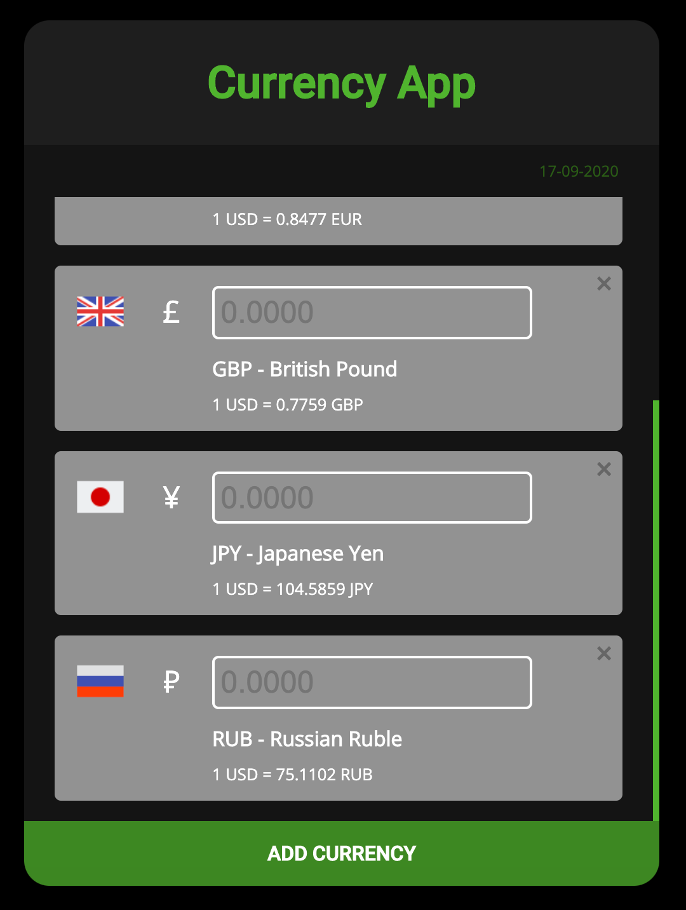

# Currency App Project

A currency convertor made with HTML, CSS, and JavaScript. 

## Skills & Languages Used

> - HTML5
> - CSS (Responsive)
> - JavaScript (no libraries) 
> - Supports 33 currencies
> - API implemention

